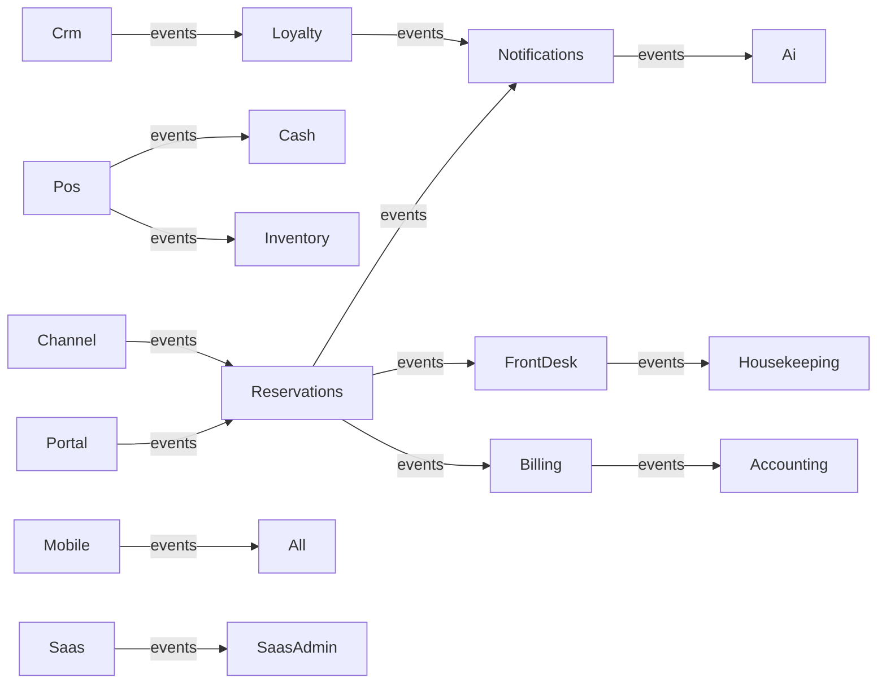
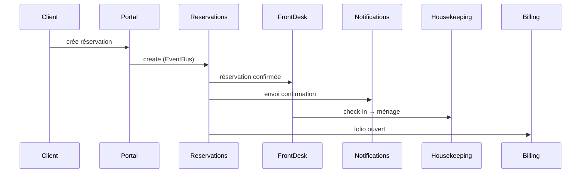
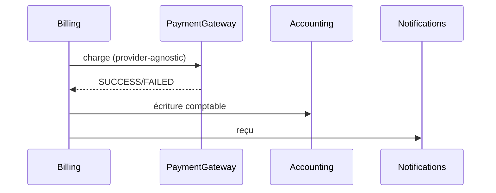

# ARCHITECTURE.md — AfriHost AI

> **Statut : DOCUMENTATION FINALE — Module 36 (Documentation, Architecture Finale & Audit de Scalabilité).**
> Version de référence : 1.0.0 · **Production Ready.**

Ce document décrit l'architecture globale d'**AfriHost AI**, un PMS hôtelier **SaaS multihôtel** pour l'Afrique.
Il couvre l'architecture générale, les modules et leurs interactions, l'isolation **Multi-Tenant**, les politiques
**RLS / RBAC**, les services métiers, les API (internes et publiques), les connecteurs, les fournisseurs externes
et les flux de données.

---

## 1. Vue d'ensemble

```
┌──────────────────────────────────────────────────────────────────────────┐
│                         CLIENTS (PWA / Web / Mobile)                     │
│        Portail Client · Interface employés · Tableau de bord managers    │
└──────────────────────────────────────┬───────────────────────────────────┘
                                       │ HTTPS / API First
┌──────────────────────────────────────▼───────────────────────────────────┐
│  Next.js 14 (App Router) — apps/web — Vercel                            │
│  • Routes API /api/* (RBAC via @afrihost/core)                          │
│  • Pages (écrans métiers) + PWA (manifest, service worker)              │
└──────────────────────────────────────┬───────────────────────────────────┘
                                       │
┌──────────────────────────────────────▼───────────────────────────────────┐
│  @afrihost/core  (infrastructure cœur)                                  │
│  EventBus · RBAC (permissions/rôles) · Audit · Tenant · Offline/Outbox  │
└──────────────────────────────────────┬───────────────────────────────────┘
                                       │
┌──────────────────────────────────────▼───────────────────────────────────┐
│  @afrihost/domain  (37 modules métier — services purs)                  │
│  reservations, rooms, housekeeping, pos, billing, crm, loyalty, ai,     │
│  channel, portal, events, bi, admin, publicapi, mobile, saas, saasadmin,│
│  bootstrap, devops, certification …                                     │
└──────────────────────────────────────┬───────────────────────────────────┘
                                       │ Adapters Prisma (repository pattern)
┌──────────────────────────────────────▼───────────────────────────────────┐
│  Supabase (PostgreSQL) — RLS multi-tenant                               │
│  • 160+ tables · 31+ migrations versionnées · policies RLS par hôtel    │
│  • Super Admin isolé (auth_platform_admin)                              │
└──────────────────────────────────────────────────────────────────────────┘
```

- **Frontend/Backend** : Next.js 14 (monolithe modulaire, API routes).
- **Domaine** : packages purs (`@afrihost/core`, `@afrihost/domain`) — Clean Architecture, SOLID.
- **Persistance** : Supabase/PostgreSQL + Prisma 5.
- **Auth** : Supabase Auth + RBAC applicatif (`@afrihost/core`).

---

## 2. Modules et interactions

### 2.1 Liste des modules (37 dans `packages/domain/src/modules`)
Fondation, Settings, Hotels, Reservations, Audit, Guests, RoomTypes, Rooms, Stay, FrontDesk, Housekeeping,
Maintenance, Laundry, Transport, Pos, Kitchen, Cash, Tips, Discounts, Inventory, Accounting, Billing, Crm,
Loyalty, Notifications, Ai, Channel, Portal, Events, Bi, Admin, PublicApi, Mobile, Saas, SaasAdmin, Bootstrap,
Devops, Certification.

### 2.2 Interactions (découplées via l'EventBus)


Chaque module est un **connecteur** : il publie/écoute des événements (`@afrihost/core/events/event-catalog.js`)
sans dépendance forte entre modules (découplage, Open/Closed).

---

## 3. Architecture Multi-Tenant

### 3.1 Identifiant tenant
Chaque hôtel possède un identifiant unique. Dans le schéma, la colonne est nommée `hotelId` (équivalente au
concept `tenant_id`). **Toutes les tables métier critiques portent `hotelId`** :
- Réservations, chambres, types de chambres, séjours, housekeeping, maintenance, blanchisserie, transport,
  POS, cuisine, caisse, pourboires, remises, stock, comptabilité, facturation, CRM, fidélité, notifications,
  IA, channel, portail, mobile, événements, BI, admin (config hôtel).

### 3.2 Isolation
- **RLS PostgreSQL** : chaque table métier a des policies `auth_has_hotel("hotelId")` — un utilisateur ne voit
  que les lignes de SON hôtel. `FORCE ROW LEVEL SECURITY` est activé (défense en profondeur).
- **Isolation métier** : chaque service vérifie `actor.hotelId === hotelId` (rejet inter-hôtel).
- **Super Admin** : entités SaaS/DevOps/Certification isolées via `auth_platform_admin()` (modules 32-35,
  exclusivement portail Super Administration).

### 3.3 Vérifications d'isolation (tests RLS sur base réelle)
Chaque module dispose d'un test `infra/supabase/NN-rls-test-*.sql` exécuté sur la base réelle : un utilisateur
de Cotonou voit ses données et **0** de Dakar ; et inversement. Tous les tests sont **PASS**.

---

## 4. RLS & RBAC

### 4.1 RLS
- Helpers : `auth_user_id()`, `auth_org_id()`, `auth_has_hotel(p_hotel)`, `auth_org_admin()`,
  `auth_platform_admin()`, `auth_in_program(programId)` (fidélité groupe d'hôtels).
- Politiques : `select/insert/update/delete` filtrées par `hotelId`.

### 4.2 RBAC
- **Permissions** : registre `module.action` dans `@afrihost/core/rbac/permissions.ts` (ex : `reservations.create`,
  `saas.plans`, `saasadmin.hotels`, `devops.health`, `certification.audit`).
- **Rôles système** : `PLATFORM_ADMIN`, `HOTEL_OWNER`, `FRONT_DESK`, `HOUSEKEEPING`, `CASHIER`, `WAITER`,
  `KITCHEN`, `STOCK_MANAGER`, `ACCOUNTANT`, `MAINTENANCE`, `GUEST`.
- Chaque route API appelle `requireAuthAndPermission("<perm>")`.

---

## 5. Services métiers
Tous sont des classes pures (`@afrihost/domain`) instanciées dans `apps/web/src/lib/di.ts` (Injection de
Dépendances, singletons par requête). Chaque service reçoit un **repository** (port) + `AuditTrail` + `EventBus`.

---

## 6. API

### 6.1 API internes
- `/api/{module}/...` — toutes les routes consomment `requireAuthAndPermission` (RBAC).

### 6.2 API publiques (Module 30)
- `/api/publicapi/...` — OAuth2, API Keys, JWT, Webhooks, rate limiting, sandbox, marketplace.
- Documentation : voir `API_REFERENCE.md`.

---

## 7. Connecteurs (Provider Agnostic)
| Domaine | Port | Exemples de fournisseurs |
|---|---|---|
| Paiements | `SaasPaymentGateway` | Stripe, Flutterwave, Paystack, CinetPay, FedaPay, PayPal, Paddle, Mobile Money |
| IA / LLM | `LlmClient` | OpenAI, Anthropic, Gemini, Azure, Ollama |
| Email/SMS/WhatsApp/Push | `NotificationSender` | Resend, Brevo, SES, SendGrid, Twilio, Infobip, Meta, FCM |
| OTA | `OtaConnector` | Booking.com, Expedia, Airbnb, Agoda, Hotelbeds |

Chaque fournisseur = **connecteur indépendant** (Open/Closed) enregistré dans un registre par clé ; le cœur ne
dépend jamais d'un fournisseur concret.

---

## 8. Flux de données (exemples)

### 8.1 Flux réservation


### 8.2 Flux paiement


### 8.3 Flux OTA / CRM / IA / Notifications
- **OTA** : Channel (job) → `OtaConnector` → Réservations (déduplication par `otaBookingId`).
- **CRM** : interactions/segments/campagnes → Notifications.
- **IA** : prédictions/suggestions (règles déterministes) → tableau de bord.
- **Notifications** : déclencheurs (réservation, paiement, fidélité…) → file d'attente → `NotificationSender`.

---

## 9. Conclusion
Architecture **Clean Architecture + SOLID + Multi-Tenant + Provider Agnostic + Event Driven**, validée par
**424 tests verts**, RLS vérifiés sur base réelle, **Production Ready**.
